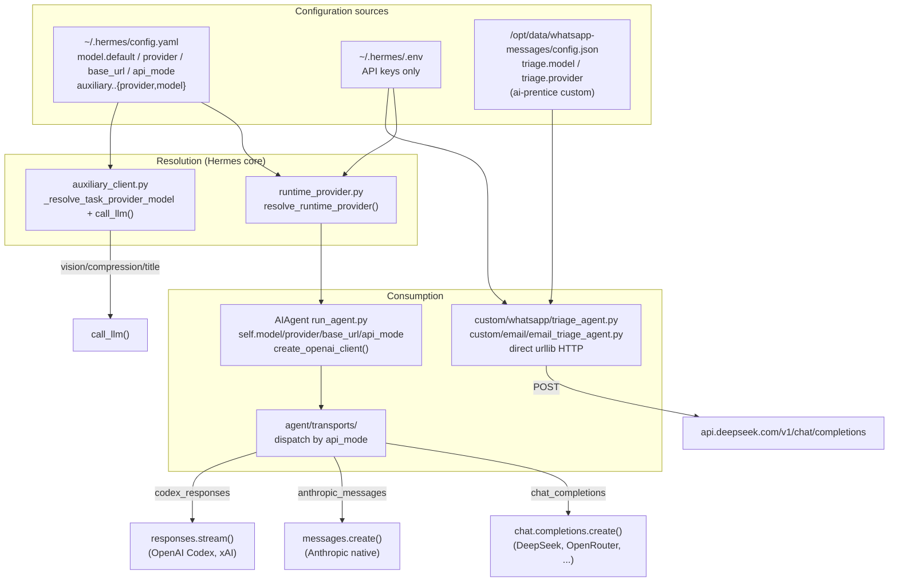

# LLM Model Configuration & Consumption

> How LLM models are configured and consumed across the ai-prentice framework,
> which inherits its agent core from [Hermes Agent](../AGENTS.md).
>
> Covers both the **Hermes core agent** (inherited) and the **ai-prentice custom
> services** (the layer built on top: WhatsApp / email / calendar triage).

## Overview

There are **two distinct LLM consumption stacks** in this deployment:

1. **Hermes core agent** — full provider-resolution + OpenAI SDK + transport
   abstraction. Configured via `~/.hermes/config.yaml` (`model:` block).
2. **ai-prentice custom services** — direct `urllib` HTTP calls to DeepSeek,
   bypassing Hermes' provider layer. Configured via per-service `config.json`
   (`triage:` block).



---

## 1. Configuration — where models are declared

### 1a. Main agent (Hermes core) — `~/.hermes/config.yaml`

a.k.a. `$HERMES_HOME/config.yaml`. The `model:` block, loaded by
`load_cli_config()` in [`cli.py`](../cli.py):

```yaml
model:
  default: deepseek-v4-pro      # the model slug actually sent to the API
  provider: auto                # "auto" = detect from env/credentials, or explicit
                                #   (deepseek, anthropic, openrouter, openai-codex, ...)
  base_url: ""                   # endpoint override (empty = provider default)
  api_mode: ""                  # "" | chat_completions | codex_responses | anthropic_messages
  openai_runtime: ""           # optional: "codex_app_server"
```

Plus **per-auxiliary-task overrides** (vision, compression, session_search,
web_extract, title_generation), documented in
[`agent/auxiliary_client.py`](../agent/auxiliary_client.py):

```yaml
auxiliary:
  vision:
    provider: auto
    model: ''                   # empty = inherit the main default
    base_url: ''
    api_key_env: ''
```

**Defaults & merge order** ([`cli.py`](../cli.py), `load_cli_config()`):
hardcoded defaults → `config.yaml` (deep-merged) → `${ENV_VAR}` expansion →
managed-scope overlay (admin-pinned values win last).

> Per [`AGENTS.md`](../AGENTS.md): `.env` is **secrets only** (API keys,
> tokens, passwords). All behavioral settings — model, provider, base_url,
> api_mode, timeouts, thresholds — go in `config.yaml`.

### 1b. ai-prentice custom services — per-service `config.json`

The triage services have their **own** config, separate from Hermes:

```json
"triage": {
  "model": "deepseek-chat",
  "provider": "deepseek",
  "skills_dir": "/opt/data/skills/whatsapp-triage/",
  "use_hermes_memory": true
}
```

- Template: [`custom/config/config.example.json`](../custom/config/config.example.json)
- Runtime paths:
  - WhatsApp: `/opt/data/whatsapp-messages/config.json`
  - Email: `/opt/data/email-messages/config.json`

---

## 2. Resolution — how provider/model/base_url/api_mode are decided

### 2a. Main agent — `resolve_runtime_provider()`

File: [`hermes_cli/runtime_provider.py`](../hermes_cli/runtime_provider.py)

The central chokepoint. Given a requested provider (or `auto`), it returns a
dict `{provider, api_mode, base_url, api_key, source}`. Key behaviors:

- **`auto`** walks an auto-detection chain:
  Nous Portal → Codex OAuth → xAI OAuth → Qwen OAuth → env-var providers
  (OpenRouter / custom endpoint).
- **`api_mode` auto-detection** via `_detect_api_mode_for_url()`:
  - `api.openai.com` / `api.x.ai` → `codex_responses`
  - `api.anthropic.com` → `anthropic_messages`
  - `…/anthropic` suffix or `api.kimi.com/coding` → `anthropic_messages`
  - else → `chat_completions`
- Per-provider branches for: `openai-codex`, `xai-oauth`, `qwen-oauth`,
  `minimax-oauth`, `anthropic`, `azure-foundry`, `opencode-zen`/`opencode-go`,
  `lmstudio`, `copilot`, `nous`, `openrouter`, `custom`, …
- **Model-family inference**: e.g. GPT-5.x / codex models on Azure
  auto-upgrade `chat_completions` → `codex_responses` (Azure rejects
  `/chat/completions` for those — returns `400 "unsupported"`).

### 2b. Auxiliary tasks — `call_llm()` + `_resolve_task_provider_model()`

File: [`agent/auxiliary_client.py`](../agent/auxiliary_client.py)

A **single fallback chain** so every secondary consumer (compression, vision,
session search, web extraction, title generation) reuses one path.

For **text tasks** (`auto`):
1. User's main provider + main model (regardless of provider type)
2. OpenRouter (`OPENROUTER_API_KEY`)
3. Nous Portal (`~/.hermes/auth.json` active provider)
4. Custom endpoint (`config.yaml model.base_url` + `OPENAI_API_KEY`)
5. Native Anthropic
6. Direct API-key providers (z.ai / GLM, Kimi / Moonshot, MiniMax, MiniMax-CN)
7. None

For **vision / multimodal** (`auto`):
1. Selected main provider, if it's a supported vision backend
2. OpenRouter
3. Nous Portal
4. Native Anthropic
5. Custom endpoint (local vision models: Qwen-VL, LLaVA, Pixtral, …)
6. None

> **Credit-exhaustion fallback**: when a resolved provider returns HTTP 402 or a
> credit-related error, `call_llm()` automatically retries with the next
> available provider in the auto-detection chain.

Codex OAuth (ChatGPT-account auth) is intentionally **not** in either fallback
chain — OpenAI gates it behind a shifting model allow-list.

---

## 3. Consumption — how the LLM is actually called

### 3a. Main agent loop — `AIAgent`

File: [`run_agent.py`](../run_agent.py)

The agent holds `self.model`, `self.provider`, `self.base_url`,
`self.api_mode`, `self._client_kwargs`. The OpenAI SDK client is built at a
**single call site** — `create_openai_client()` in
[`agent/agent_runtime_helpers.py`](../agent/agent_runtime_helpers.py)
(forwarded from `_create_openai_client` at `run_agent.py:3916`) — and cached as
`self.client`, with `_client_kwargs` carrying `api_key` / `base_url`.

Actual API I/O is dispatched by `api_mode` through the **transport layer** in
[`agent/transports/`](../agent/transports):

| `api_mode` | Transport | Wire call | Providers |
|---|---|---|---|
| `chat_completions` (default) | [`chat_completions.py`](../agent/transports/chat_completions.py) | `chat.completions.create()` | DeepSeek, OpenRouter, Nous, xAI, Kimi, Qwen, Ollama (~16) |
| `anthropic_messages` | [`anthropic.py`](../agent/transports/anthropic.py) | `messages.create()` | Anthropic native, MiniMax `/anthropic`, Kimi `/coding` |
| `codex_responses` | [`codex.py`](../agent/transports/codex.py) | `responses.stream()` | OpenAI Codex, xAI OAuth |
| `codex_app_server` | [`codex_app_server.py`](../agent/transports/codex_app_server.py) | Codex app-server | opt-in via `model.openai_runtime` |
| Bedrock | [`bedrock.py`](../agent/transports/bedrock.py) | Bedrock runtime | AWS Bedrock |

**Mid-session model switch**: `switch_model()` (`run_agent.py:798`, impl in
`agent_runtime_helpers.py`) updates model/provider/base_url/api_mode and
rebuilds the client. `target_model` is threaded through
`resolve_runtime_provider()` so `api_mode` is recomputed for the *new* model,
not the stale default.

### 3b. Auxiliary consumers — `call_llm()` via `resolve_provider_client()`

File: [`agent/auxiliary_client.py`](../agent/auxiliary_client.py)

`resolve_provider_client()` is the central router returning a client that
**always exposes `.chat.completions.create()`** — Codex/Responses providers get
wrapped in `CodexAuxiliaryClient` so callers stay uniform regardless of
transport.

### 3c. ai-prentice custom triage agents — direct HTTP (the ai-prentice layer)

Files:
- [`custom/whatsapp/triage_agent.py`](../custom/whatsapp/triage_agent.py)
- [`custom/email/email_triage_agent.py`](../custom/email/email_triage_agent.py)

These **bypass Hermes' provider layer entirely**:

```python
DEEPSEEK_MODEL    = config.get('triage', {}).get('model', 'deepseek-chat')
DEEPSEEK_BASE_URL = 'https://api.deepseek.com/v1/chat/completions'
DEEPSEEK_API_KEY  = os.environ.get('DEEPSEEK_API_KEY', '')

def call_deepseek(messages, temperature=0.3, max_tokens=2000):
    payload = {'model': DEEPSEEK_MODEL, 'messages': messages,
               'temperature': temperature, 'max_tokens': max_tokens,
               'response_format': {'type': 'json_object'}}
    req = Request(DEEPSEEK_BASE_URL, data=json.dumps(payload).encode(),
                  headers={'Content-Type': 'application/json',
                           'Authorization': f'Bearer {DEEPSEEK_API_KEY}'})
    return track_inference("WhatsApp processing", _do_api_call)  # credit tracking
```

Characteristics:
- Raw `urllib` (not the OpenAI SDK, not `call_llm`).
- Force `response_format: json_object` for structured triage output.
- Wrap calls in `track_inference()` for credit accounting
  (`track_credit_helper`).

---

## 4. Model catalogs & metadata

- [`hermes_cli/models.py`](../hermes_cli/models.py) — `OPENROUTER_MODELS`,
  Copilot models, etc. Used by `hermes setup` / provider-selection menus
  (includes `deepseek/deepseek-v4-pro`, `deepseek/deepseek-v4-flash`).
- [`agent/model_metadata.py`](../agent/model_metadata.py) — context limits,
  token estimation, provider-prefix stripping (recognizes `deepseek`,
  `anthropic`, `openrouter`, …).

---

## 5. Concrete mapping to the running ECS instance

Instance: `i-j6c81aisv2dd8mg17yle` (hermes-systest, `cn-hongkong`),
`HERMES_HOME=/opt/data/hermes-home-staging`.

| Consumer | Config source | Resolved by | Wire path | Model |
|---|---|---|---|---|
| Hermes gateway agent | `config.yaml` `model.default` | `resolve_runtime_provider()` → transport `chat_completions` | OpenAI SDK → `api.deepseek.com/v1` | `deepseek-v4-pro` |
| Auxiliary (vision/title/etc.) | `config.yaml` `auxiliary.*` (auto/empty) | `call_llm()` fallback chain | inherits main | `deepseek-v4-pro` |
| WhatsApp / email / calendar triage | `config.json` `triage.model` | none (direct `urllib`) | `urllib` POST → `api.deepseek.com/v1/chat/completions` | `deepseek-chat` |

### Key architectural note

The ai-prentice custom services chose a deliberately simpler, isolated
DeepSeek-only HTTP path rather than routing through Hermes' provider-resolution
layer. Trade-offs:

- **They don't inherit** Hermes' automatic provider fallback, prompt-cache
  affinity, or transport abstraction.
- **They also can't break** the main agent's per-conversation prompt cache
  (which [`AGENTS.md`](../AGENTS.md) treats as sacred) — the custom services run
  as independent processes with their own one-shot `urllib` calls, fully
  decoupled from the cached agent conversation prefix.

---

## File reference

| Layer | File | Role |
|---|---|---|
| Config | `~/.hermes/config.yaml` | main agent `model:` + `auxiliary:` settings |
| Config | `~/.hermes/.env` | API keys only |
| Config | `/opt/data/{whatsapp,email}-messages/config.json` | ai-prentice `triage:` settings |
| Config load | [`cli.py`](../cli.py) `load_cli_config()` | defaults + config.yaml + env + managed-scope merge |
| Resolution | [`hermes_cli/runtime_provider.py`](../hermes_cli/runtime_provider.py) `resolve_runtime_provider()` | main agent provider/api_mode/base_url/api_key |
| Resolution | [`agent/auxiliary_client.py`](../agent/auxiliary_client.py) `_resolve_task_provider_model()` + `call_llm()` | auxiliary fallback chain |
| Consumption | [`run_agent.py`](../run_agent.py) `AIAgent` | holds model/provider/base_url/api_mode/client |
| Consumption | [`agent/agent_runtime_helpers.py`](../agent/agent_runtime_helpers.py) `create_openai_client()` / `switch_model()` | single OpenAI client call site + mid-session switch |
| Transports | [`agent/transports/`](../agent/transports) | per-`api_mode` wire dispatch |
| Catalogs | [`hermes_cli/models.py`](../hermes_cli/models.py) | model menus |
| Metadata | [`agent/model_metadata.py`](../agent/model_metadata.py) | context limits, token est, prefix strip |
| ai-prentice | [`custom/whatsapp/triage_agent.py`](../custom/whatsapp/triage_agent.py) | direct DeepSeek HTTP (WhatsApp) |
| ai-prentice | [`custom/email/email_triage_agent.py`](../custom/email/email_triage_agent.py) | direct DeepSeek HTTP (email) |
